# BLAS libraries benchmarks
Andrzej Wójtowicz  

Document generation date: 2016-05-26 19:23:05

## Table of Contents

 1. [Configuration](#configuration)
 2. [Results per host](#results-per-host)
    * [Intel Core i5-4590 + NVIDIA GeForce GT 430](#intel-core-i5-4590-nvidia-geforce-gt-430)
    * [Intel Core i5-3570](#intel-core-i5-3570)
    * [Intel Core i3-2120](#intel-core-i3-2120)
    * [Intel Core i3-3120M](#intel-core-i3-3120m)
 3. [Results per library](#results-per-library)
    * [Netlib](#netlib)
    * [Atlas (st)](#atlas-st)
    * [OpenBLAS](#openblas)
    * [Atlas (mt)](#atlas-mt)
    * [GotoBLAS2](#gotoblas2)
    * [MKL](#mkl)
    * [BLIS](#blis)
 
***

## Configuration

**R software**: [Microsoft R Open](https://mran.microsoft.com/open/).

**Libraries**:

|CPU (single-threaded)|CPU (multi-threaded)|GPU|
|---|---|---|
|[Netlib](http://www.netlib.org/) (debian package)|[OpenBLAS](http://www.openblas.net/) (debian package)|[NVIDIA cuBLAS](https://developer.nvidia.com/cublas) (NVBLAS + Intel MKL)|
|[ATLAS](http://math-atlas.sourceforge.net/) (debian package)|[ATLAS](http://math-atlas.sourceforge.net/) (dev branch)|   |
|   |[GotoBLAS2](https://prs.ism.ac.jp/~nakama/SurviveGotoBLAS2/) (Survive fork)|   |
|   |[Intel MKL](https://mran.microsoft.com/download/) (part of Microsoft R Open)|   |
|   |[BLIS](https://github.com/flame/blis)|   |

**Hosts**:

|No.|CPU|GPU|
|---|---|---|
|1.|[Intel Core i5-4590](http://ark.intel.com/products/80815/Intel-Core-i5-4590-Processor-6M-Cache-up-to-3_70-GHz)|[NVIDIA GeForce GT 430](http://www.geforce.com/hardware/desktop-gpus/geforce-gt-430/specifications)|
|2.|[Intel Core i5-3570](http://ark.intel.com/products/65702/Intel-Core-i5-3570-Processor-6M-Cache-up-to-3_80-GHz)| - |
|3.|[Intel Core i3-2120](http://ark.intel.com/products/53426/Intel-Core-i3-2120-Processor-3M-Cache-3_30-GHz)| - |
|4.|[Intel Core i3-3120M](http://ark.intel.com/products/71465/Intel-Core-i3-3120M-Processor-3M-Cache-2_50-GHz)| - |

**Benchmarks**: [Urbanek](http://r.research.att.com/benchmarks/R-benchmark-25.R), [Revolution](https://gist.github.com/andrie/24c9672f1ea39af89c66#file-rro-mkl-benchmark-r), [Gcbd](https://cran.r-project.org/web/packages/gcbd/vignettes/gcbd.pdf).

# Results per host

## Intel Core i5-4590 + NVIDIA GeForce GT 430

### Urbanek benchmark

#### 2800x2800 cross-product matrix 

Time in seconds  - 10 runs - lower is better

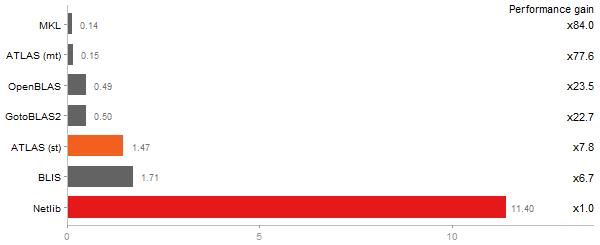

#### Linear regr. over a 3000x3000 matrix 

Time in seconds  - 10 runs - lower is better

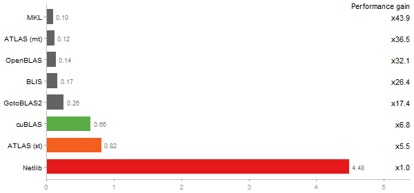

#### Eigenvalues of a 640x640 random matrix 

Time in seconds  - 10 runs - lower is better

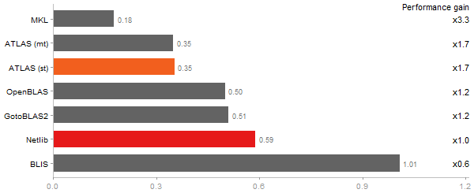

#### Determinant of a 2500x2500 random matrix 

Time in seconds  - 10 runs - lower is better

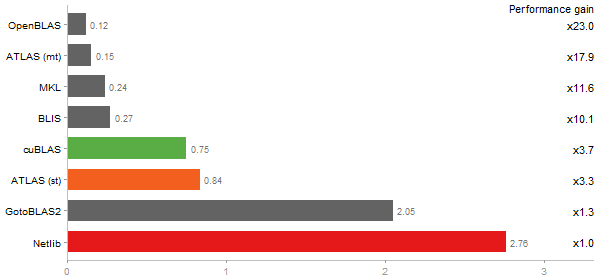

#### Cholesky decomposition of a 3000x3000 matrix 

Time in seconds  - 10 runs - lower is better

#### Inverse of a 1600x1600 random matrix 

Time in seconds  - 10 runs - lower is better

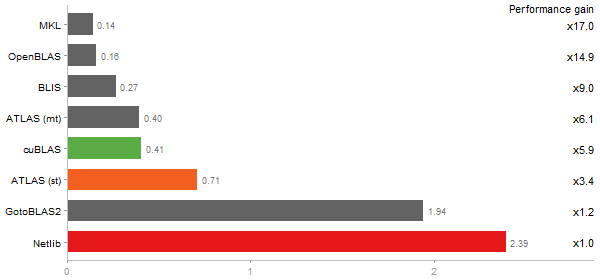

#### Escoufier's method on a 45x45 matrix 

Time in seconds  - 10 runs - lower is better

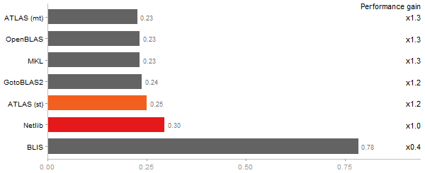

### Revolution benchmark

#### Matrix Multiply 

Time in seconds  - 10 runs - lower is better

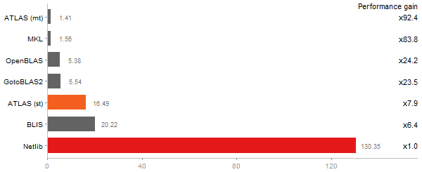

#### Cholesky Factorization 

Time in seconds  - 10 runs - lower is better

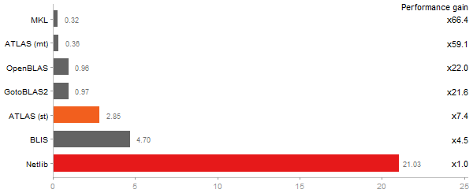

#### Singular Value Deomposition 

Time in seconds  - 10 runs - lower is better

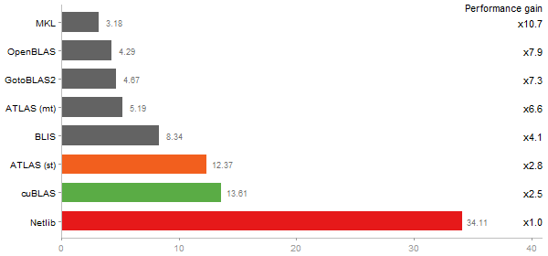

#### Principal Components Analysis 

Time in seconds  - 10 runs - lower is better

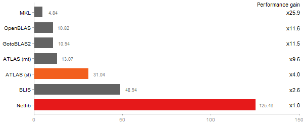

#### Linear Discriminant Analysis 

Time in seconds  - 10 runs - lower is better

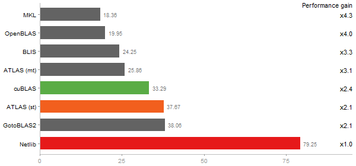

### Gcbd benchmark

#### Matrix Multiply 

Time in seconds regarding matrix size - right panel on log scale -  from  50  to  5 runs - lower is better

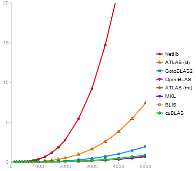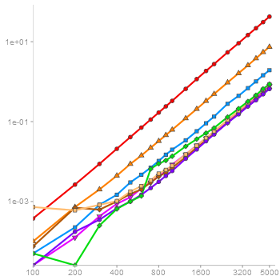

#### QR Decomposition 

Time in seconds regarding matrix size - right panel on log scale -  from  50  to  5 runs - lower is better

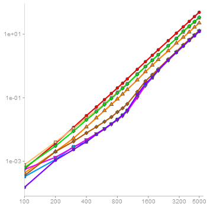

#### Singular Value Deomposition 

Time in seconds regarding matrix size - right panel on log scale -  from  50  to  5 runs - lower is better

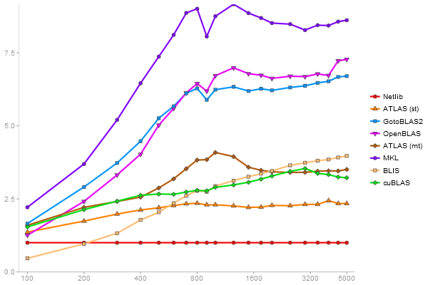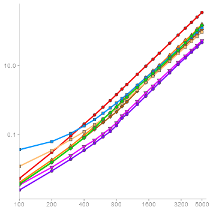

#### Triangular Decomposition 

Time in seconds regarding matrix size - right panel on log scale -  from  50  to  5 runs - lower is better

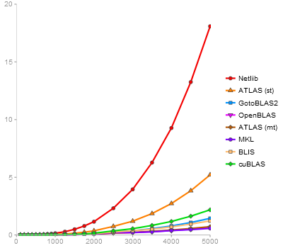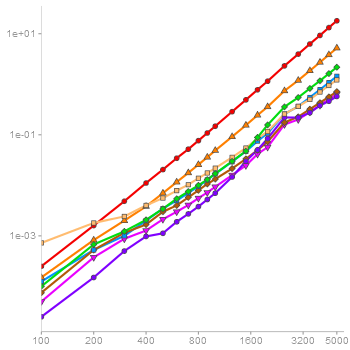

## Intel Core i5-3570

### Urbanek benchmark

#### 2800x2800 cross-product matrix 

Time in seconds  - 10 runs - lower is better

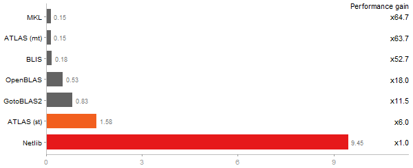

#### Linear regr. over a 3000x3000 matrix 

Time in seconds  - 10 runs - lower is better

#### Eigenvalues of a 640x640 random matrix 

Time in seconds  - 10 runs - lower is better

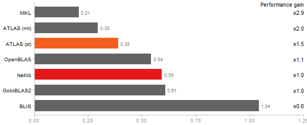

#### Determinant of a 2500x2500 random matrix 

Time in seconds  - 10 runs - lower is better

#### Cholesky decomposition of a 3000x3000 matrix 

Time in seconds  - 10 runs - lower is better

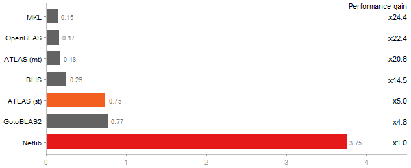

#### Inverse of a 1600x1600 random matrix 

Time in seconds  - 10 runs - lower is better

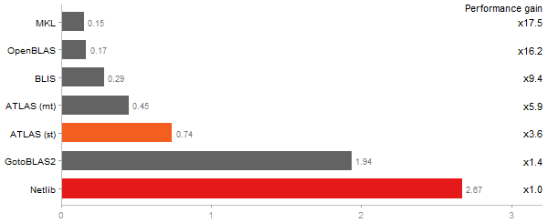

#### Escoufier's method on a 45x45 matrix 

Time in seconds  - 10 runs - lower is better

### Revolution benchmark

#### Matrix Multiply 

Time in seconds  - 10 runs - lower is better

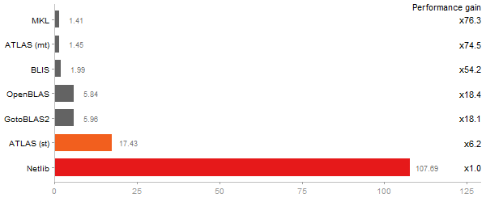

#### Cholesky Factorization 

Time in seconds  - 10 runs - lower is better

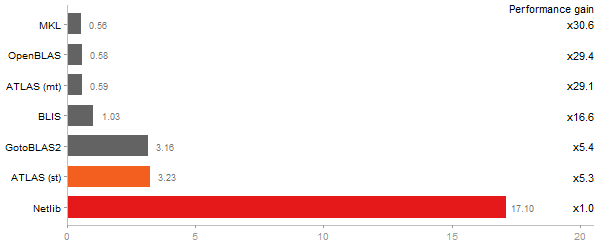

#### Singular Value Deomposition 

Time in seconds  - 10 runs - lower is better

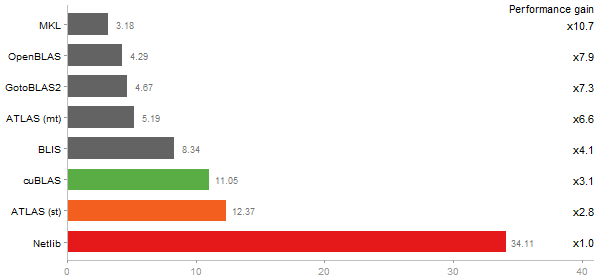

#### Principal Components Analysis 

Time in seconds  - 10 runs - lower is better

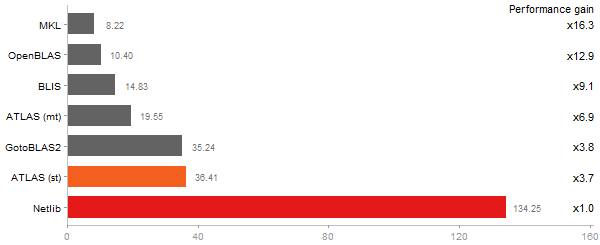

#### Linear Discriminant Analysis 

Time in seconds  - 10 runs - lower is better

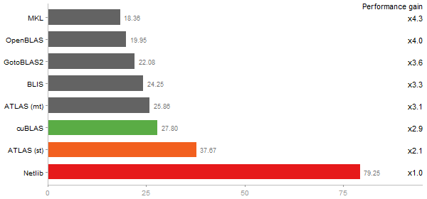

### Gcbd benchmark

#### Matrix Multiply 

Time in seconds regarding matrix size - right panel on log scale -  from  50  to  5 runs - lower is better

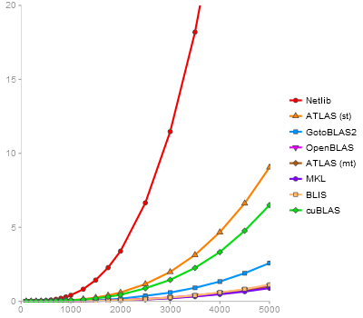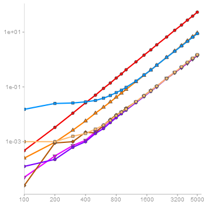

#### QR Decomposition 

Time in seconds regarding matrix size - right panel on log scale -  from  50  to  5 runs - lower is better

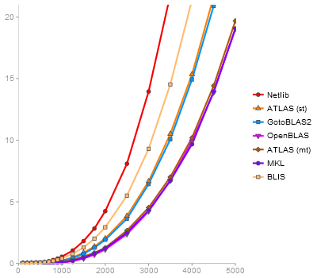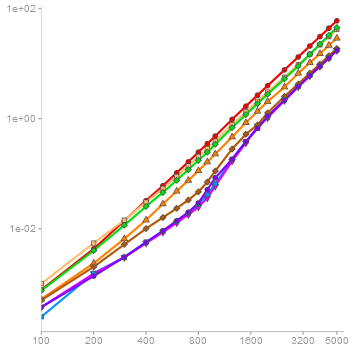

#### Singular Value Deomposition 

Time in seconds regarding matrix size - right panel on log scale -  from  50  to  5 runs - lower is better

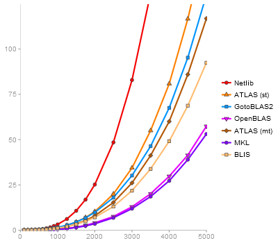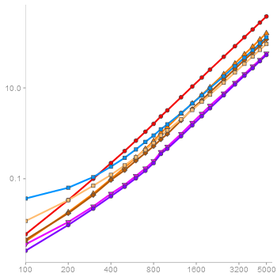

#### Triangular Decomposition 

Time in seconds regarding matrix size - right panel on log scale -  from  50  to  5 runs - lower is better

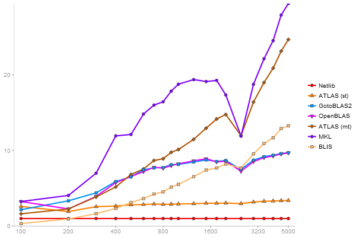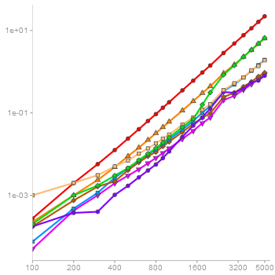

## Intel Core i3-2120

### Urbanek benchmark

#### 2800x2800 cross-product matrix 

Time in seconds  - 10 runs - lower is better

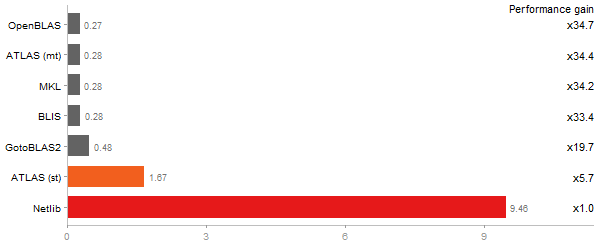

#### Linear regr. over a 3000x3000 matrix 

Time in seconds  - 10 runs - lower is better

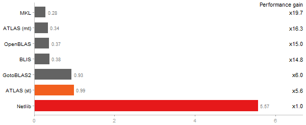

#### Eigenvalues of a 640x640 random matrix 

Time in seconds  - 10 runs - lower is better

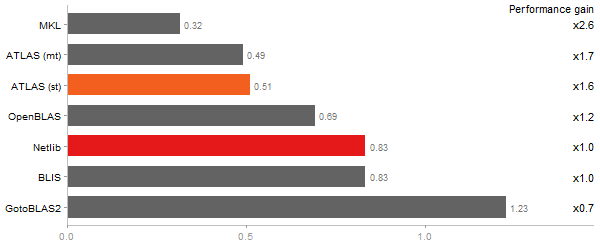

#### Determinant of a 2500x2500 random matrix 

Time in seconds  - 10 runs - lower is better

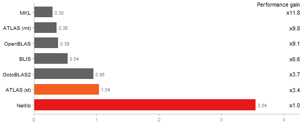

#### Cholesky decomposition of a 3000x3000 matrix 

Time in seconds  - 10 runs - lower is better

#### Inverse of a 1600x1600 random matrix 

Time in seconds  - 10 runs - lower is better

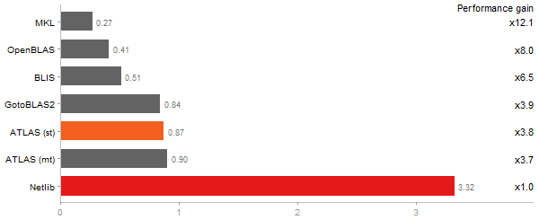

#### Escoufier's method on a 45x45 matrix 

Time in seconds  - 10 runs - lower is better

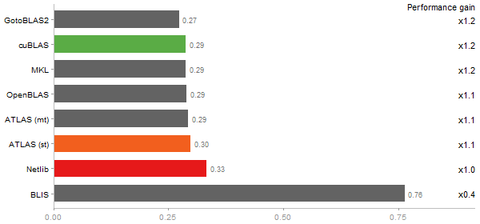

### Revolution benchmark

#### Matrix Multiply 

Time in seconds  - 10 runs - lower is better

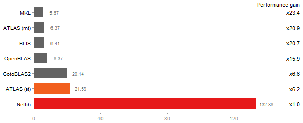

#### Cholesky Factorization 

Time in seconds  - 10 runs - lower is better

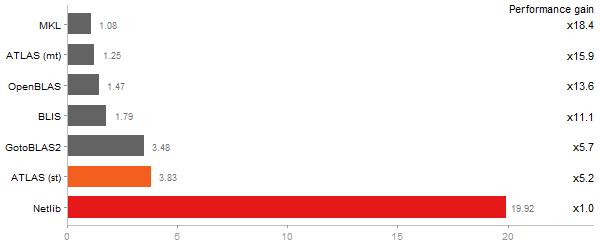

#### Singular Value Deomposition 

Time in seconds  - 10 runs - lower is better

#### Principal Components Analysis 

Time in seconds  - 10 runs - lower is better

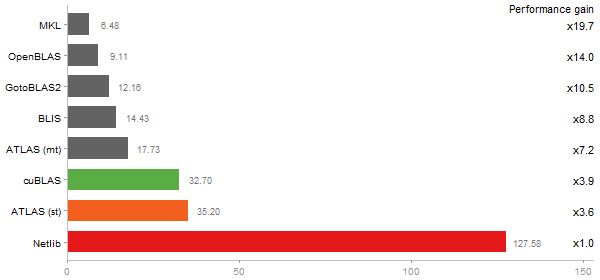

#### Linear Discriminant Analysis 

Time in seconds  - 10 runs - lower is better

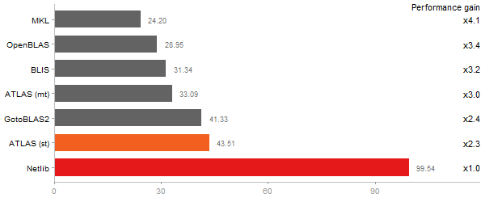

### Gcbd benchmark

#### Matrix Multiply 

Time in seconds regarding matrix size - right panel on log scale -  from  50  to  5 runs - lower is better

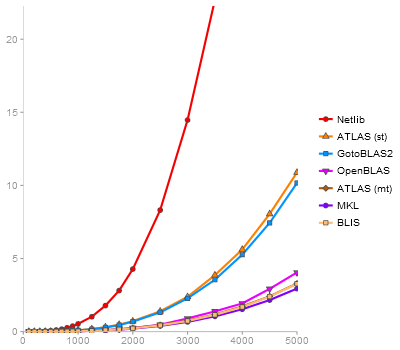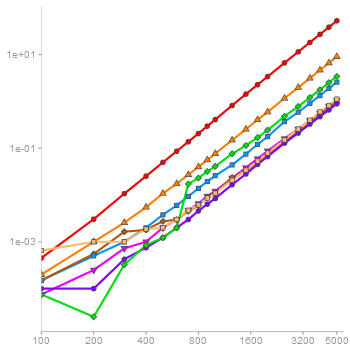

#### QR Decomposition 

Time in seconds regarding matrix size - right panel on log scale -  from  50  to  5 runs - lower is better

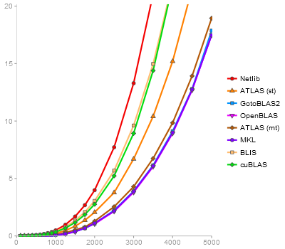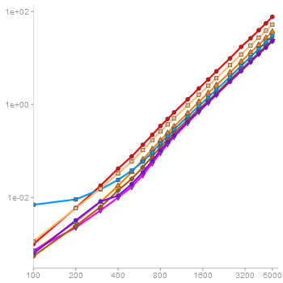

#### Singular Value Deomposition 

Time in seconds regarding matrix size - right panel on log scale -  from  50  to  5 runs - lower is better

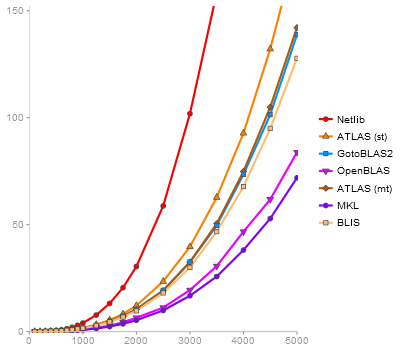

#### Triangular Decomposition 

Time in seconds regarding matrix size - right panel on log scale -  from  50  to  5 runs - lower is better

## Intel Core i3-3120M

### Urbanek benchmark

#### 2800x2800 cross-product matrix 

Time in seconds  - 10 runs - lower is better

#### Linear regr. over a 3000x3000 matrix 

Time in seconds  - 10 runs - lower is better

#### Eigenvalues of a 640x640 random matrix 

Time in seconds  - 10 runs - lower is better

#### Determinant of a 2500x2500 random matrix 

Time in seconds  - 10 runs - lower is better

#### Cholesky decomposition of a 3000x3000 matrix 

Time in seconds  - 10 runs - lower is better

#### Inverse of a 1600x1600 random matrix 

Time in seconds  - 10 runs - lower is better

#### Escoufier's method on a 45x45 matrix 

Time in seconds  - 10 runs - lower is better

### Revolution benchmark

#### Matrix Multiply 

Time in seconds  - 10 runs - lower is better

#### Cholesky Factorization 

Time in seconds  - 10 runs - lower is better

#### Singular Value Deomposition 

Time in seconds  - 10 runs - lower is better

#### Principal Components Analysis 

Time in seconds  - 10 runs - lower is better

#### Linear Discriminant Analysis 

Time in seconds  - 10 runs - lower is better

### Gcbd benchmark

#### Matrix Multiply 

Time in seconds regarding matrix size - right panel on log scale -  from  50  to  5 runs - lower is better

#### QR Decomposition 

Time in seconds regarding matrix size - right panel on log scale -  from  50  to  5 runs - lower is better

#### Singular Value Deomposition 

Time in seconds regarding matrix size - right panel on log scale -  from  50  to  5 runs - lower is better

#### Triangular Decomposition 

Time in seconds regarding matrix size - right panel on log scale -  from  50  to  5 runs - lower is better

# Results per library

## Netlib

### Urbanek benchmark

#### 2800x2800 cross-product matrix 

Time in seconds  - 10 runs - lower is better

#### Linear regr. over a 3000x3000 matrix 

Time in seconds  - 10 runs - lower is better

#### Eigenvalues of a 640x640 random matrix 

Time in seconds  - 10 runs - lower is better

#### Determinant of a 2500x2500 random matrix 

Time in seconds  - 10 runs - lower is better

#### Cholesky decomposition of a 3000x3000 matrix 

Time in seconds  - 10 runs - lower is better

#### Inverse of a 1600x1600 random matrix 

Time in seconds  - 10 runs - lower is better

#### Escoufier's method on a 45x45 matrix 

Time in seconds  - 10 runs - lower is better

### Revolution benchmark

#### Matrix Multiply 

Time in seconds  - 10 runs - lower is better

#### Cholesky Factorization 

Time in seconds  - 10 runs - lower is better

#### Singular Value Deomposition 

Time in seconds  - 10 runs - lower is better

#### Principal Components Analysis 

Time in seconds  - 10 runs - lower is better

#### Linear Discriminant Analysis 

Time in seconds  - 10 runs - lower is better

### Gcbd benchmark

#### Matrix Multiply 

Time in seconds regarding matrix size - right panel on log scale -  from  50  to  5 runs - lower is better

#### QR Decomposition 

Time in seconds regarding matrix size - right panel on log scale -  from  50  to  5 runs - lower is better

#### Singular Value Deomposition 

Time in seconds regarding matrix size - right panel on log scale -  from  50  to  5 runs - lower is better

#### Triangular Decomposition 

Time in seconds regarding matrix size - right panel on log scale -  from  50  to  5 runs - lower is better

## ATLAS (st)

### Urbanek benchmark

#### 2800x2800 cross-product matrix 

Time in seconds  - 10 runs - lower is better

#### Linear regr. over a 3000x3000 matrix 

Time in seconds  - 10 runs - lower is better

#### Eigenvalues of a 640x640 random matrix 

Time in seconds  - 10 runs - lower is better

#### Determinant of a 2500x2500 random matrix 

Time in seconds  - 10 runs - lower is better

#### Cholesky decomposition of a 3000x3000 matrix 

Time in seconds  - 10 runs - lower is better

#### Inverse of a 1600x1600 random matrix 

Time in seconds  - 10 runs - lower is better

#### Escoufier's method on a 45x45 matrix 

Time in seconds  - 10 runs - lower is better

### Revolution benchmark

#### Matrix Multiply 

Time in seconds  - 10 runs - lower is better

#### Cholesky Factorization 

Time in seconds  - 10 runs - lower is better

#### Singular Value Deomposition 

Time in seconds  - 10 runs - lower is better

#### Principal Components Analysis 

Time in seconds  - 10 runs - lower is better

#### Linear Discriminant Analysis 

Time in seconds  - 10 runs - lower is better

### Gcbd benchmark

#### Matrix Multiply 

Time in seconds regarding matrix size - right panel on log scale -  from  50  to  5 runs - lower is better

#### QR Decomposition 

Time in seconds regarding matrix size - right panel on log scale -  from  50  to  5 runs - lower is better

#### Singular Value Deomposition 

Time in seconds regarding matrix size - right panel on log scale -  from  50  to  5 runs - lower is better

#### Triangular Decomposition 

Time in seconds regarding matrix size - right panel on log scale -  from  50  to  5 runs - lower is better

## OpenBLAS

### Urbanek benchmark

#### 2800x2800 cross-product matrix 

Time in seconds  - 10 runs - lower is better

#### Linear regr. over a 3000x3000 matrix 

Time in seconds  - 10 runs - lower is better

#### Eigenvalues of a 640x640 random matrix 

Time in seconds  - 10 runs - lower is better

#### Determinant of a 2500x2500 random matrix 

Time in seconds  - 10 runs - lower is better

#### Cholesky decomposition of a 3000x3000 matrix 

Time in seconds  - 10 runs - lower is better

#### Inverse of a 1600x1600 random matrix 

Time in seconds  - 10 runs - lower is better

#### Escoufier's method on a 45x45 matrix 

Time in seconds  - 10 runs - lower is better

### Revolution benchmark

#### Matrix Multiply 

Time in seconds  - 10 runs - lower is better

#### Cholesky Factorization 

Time in seconds  - 10 runs - lower is better

#### Singular Value Deomposition 

Time in seconds  - 10 runs - lower is better

#### Principal Components Analysis 

Time in seconds  - 10 runs - lower is better

#### Linear Discriminant Analysis 

Time in seconds  - 10 runs - lower is better

### Gcbd benchmark

#### Matrix Multiply 

Time in seconds regarding matrix size - right panel on log scale -  from  50  to  5 runs - lower is better

#### QR Decomposition 

Time in seconds regarding matrix size - right panel on log scale -  from  50  to  5 runs - lower is better

#### Singular Value Deomposition 

Time in seconds regarding matrix size - right panel on log scale -  from  50  to  5 runs - lower is better

#### Triangular Decomposition 

Time in seconds regarding matrix size - right panel on log scale -  from  50  to  5 runs - lower is better

## ATLAS (mt)

### Urbanek benchmark

#### 2800x2800 cross-product matrix 

Time in seconds  - 10 runs - lower is better

#### Linear regr. over a 3000x3000 matrix 

Time in seconds  - 10 runs - lower is better

#### Eigenvalues of a 640x640 random matrix 

Time in seconds  - 10 runs - lower is better

#### Determinant of a 2500x2500 random matrix 

Time in seconds  - 10 runs - lower is better

#### Cholesky decomposition of a 3000x3000 matrix 

Time in seconds  - 10 runs - lower is better

#### Inverse of a 1600x1600 random matrix 

Time in seconds  - 10 runs - lower is better

#### Escoufier's method on a 45x45 matrix 

Time in seconds  - 10 runs - lower is better

### Revolution benchmark

#### Matrix Multiply 

Time in seconds  - 10 runs - lower is better

#### Cholesky Factorization 

Time in seconds  - 10 runs - lower is better

#### Singular Value Deomposition 

Time in seconds  - 10 runs - lower is better

#### Principal Components Analysis 

Time in seconds  - 10 runs - lower is better

#### Linear Discriminant Analysis 

Time in seconds  - 10 runs - lower is better

### Gcbd benchmark

#### Matrix Multiply 

Time in seconds regarding matrix size - right panel on log scale -  from  50  to  5 runs - lower is better

#### QR Decomposition 

Time in seconds regarding matrix size - right panel on log scale -  from  50  to  5 runs - lower is better

#### Singular Value Deomposition 

Time in seconds regarding matrix size - right panel on log scale -  from  50  to  5 runs - lower is better

#### Triangular Decomposition 

Time in seconds regarding matrix size - right panel on log scale -  from  50  to  5 runs - lower is better

## GotoBLAS2

### Urbanek benchmark

#### 2800x2800 cross-product matrix 

Time in seconds  - 10 runs - lower is better

#### Linear regr. over a 3000x3000 matrix 

Time in seconds  - 10 runs - lower is better

#### Eigenvalues of a 640x640 random matrix 

Time in seconds  - 10 runs - lower is better

#### Determinant of a 2500x2500 random matrix 

Time in seconds  - 10 runs - lower is better

#### Cholesky decomposition of a 3000x3000 matrix 

Time in seconds  - 10 runs - lower is better

#### Inverse of a 1600x1600 random matrix 

Time in seconds  - 10 runs - lower is better

#### Escoufier's method on a 45x45 matrix 

Time in seconds  - 10 runs - lower is better

### Revolution benchmark

#### Matrix Multiply 

Time in seconds  - 10 runs - lower is better

#### Cholesky Factorization 

Time in seconds  - 10 runs - lower is better

#### Singular Value Deomposition 

Time in seconds  - 10 runs - lower is better

#### Principal Components Analysis 

Time in seconds  - 10 runs - lower is better

#### Linear Discriminant Analysis 

Time in seconds  - 10 runs - lower is better

### Gcbd benchmark

#### Matrix Multiply 

Time in seconds regarding matrix size - right panel on log scale -  from  50  to  5 runs - lower is better

#### QR Decomposition 

Time in seconds regarding matrix size - right panel on log scale -  from  50  to  5 runs - lower is better

#### Singular Value Deomposition 

Time in seconds regarding matrix size - right panel on log scale -  from  50  to  5 runs - lower is better

#### Triangular Decomposition 

Time in seconds regarding matrix size - right panel on log scale -  from  50  to  5 runs - lower is better

## MKL

### Urbanek benchmark

#### 2800x2800 cross-product matrix 

Time in seconds  - 10 runs - lower is better

#### Linear regr. over a 3000x3000 matrix 

Time in seconds  - 10 runs - lower is better

#### Eigenvalues of a 640x640 random matrix 

Time in seconds  - 10 runs - lower is better

#### Determinant of a 2500x2500 random matrix 

Time in seconds  - 10 runs - lower is better

#### Cholesky decomposition of a 3000x3000 matrix 

Time in seconds  - 10 runs - lower is better

#### Inverse of a 1600x1600 random matrix 

Time in seconds  - 10 runs - lower is better

#### Escoufier's method on a 45x45 matrix 

Time in seconds  - 10 runs - lower is better

### Revolution benchmark

#### Matrix Multiply 

Time in seconds  - 10 runs - lower is better

#### Cholesky Factorization 

Time in seconds  - 10 runs - lower is better

#### Singular Value Deomposition 

Time in seconds  - 10 runs - lower is better

#### Principal Components Analysis 

Time in seconds  - 10 runs - lower is better

#### Linear Discriminant Analysis 

Time in seconds  - 10 runs - lower is better

### Gcbd benchmark

#### Matrix Multiply 

Time in seconds regarding matrix size - right panel on log scale -  from  50  to  5 runs - lower is better

#### QR Decomposition 

Time in seconds regarding matrix size - right panel on log scale -  from  50  to  5 runs - lower is better

#### Singular Value Deomposition 

Time in seconds regarding matrix size - right panel on log scale -  from  50  to  5 runs - lower is better

#### Triangular Decomposition 

Time in seconds regarding matrix size - right panel on log scale -  from  50  to  5 runs - lower is better

## BLIS

### Urbanek benchmark

#### 2800x2800 cross-product matrix 

Time in seconds  - 10 runs - lower is better

#### Linear regr. over a 3000x3000 matrix 

Time in seconds  - 10 runs - lower is better

#### Eigenvalues of a 640x640 random matrix 

Time in seconds  - 10 runs - lower is better

#### Determinant of a 2500x2500 random matrix 

Time in seconds  - 10 runs - lower is better

#### Cholesky decomposition of a 3000x3000 matrix 

Time in seconds  - 10 runs - lower is better

#### Inverse of a 1600x1600 random matrix 

Time in seconds  - 10 runs - lower is better

#### Escoufier's method on a 45x45 matrix 

Time in seconds  - 10 runs - lower is better

### Revolution benchmark

#### Matrix Multiply 

Time in seconds  - 10 runs - lower is better

#### Cholesky Factorization 

Time in seconds  - 10 runs - lower is better

#### Singular Value Deomposition 

Time in seconds  - 10 runs - lower is better

#### Principal Components Analysis 

Time in seconds  - 10 runs - lower is better

#### Linear Discriminant Analysis 

Time in seconds  - 10 runs - lower is better

### Gcbd benchmark

#### Matrix Multiply 

Time in seconds regarding matrix size - right panel on log scale -  from  50  to  5 runs - lower is better

#### QR Decomposition 

Time in seconds regarding matrix size - right panel on log scale -  from  50  to  5 runs - lower is better

#### Singular Value Deomposition 

Time in seconds regarding matrix size - right panel on log scale -  from  50  to  5 runs - lower is better

#### Triangular Decomposition 

Time in seconds regarding matrix size - right panel on log scale -  from  50  to  5 runs - lower is better

## cuBLAS

### Urbanek benchmark

#### 2800x2800 cross-product matrix 

Time in seconds  - 10 runs - lower is better

#### Linear regr. over a 3000x3000 matrix 

Time in seconds  - 10 runs - lower is better

#### Eigenvalues of a 640x640 random matrix 

Time in seconds  - 10 runs - lower is better

#### Determinant of a 2500x2500 random matrix 

Time in seconds  - 10 runs - lower is better

#### Cholesky decomposition of a 3000x3000 matrix 

Time in seconds  - 10 runs - lower is better

#### Inverse of a 1600x1600 random matrix 

Time in seconds  - 10 runs - lower is better

#### Escoufier's method on a 45x45 matrix 

Time in seconds  - 10 runs - lower is better

### Revolution benchmark

#### Matrix Multiply 

Time in seconds  - 10 runs - lower is better

#### Cholesky Factorization 

Time in seconds  - 10 runs - lower is better

#### Singular Value Deomposition 

Time in seconds  - 10 runs - lower is better

#### Principal Components Analysis 

Time in seconds  - 10 runs - lower is better

#### Linear Discriminant Analysis 

Time in seconds  - 10 runs - lower is better

### Gcbd benchmark

#### Matrix Multiply 

Time in seconds regarding matrix size - right panel on log scale -  from  50  to  5 runs - lower is better

#### QR Decomposition 

Time in seconds regarding matrix size - right panel on log scale -  from  50  to  5 runs - lower is better

#### Singular Value Deomposition 

Time in seconds regarding matrix size - right panel on log scale -  from  50  to  5 runs - lower is better

#### Triangular Decomposition 

Time in seconds regarding matrix size - right panel on log scale -  from  50  to  5 runs - lower is better

